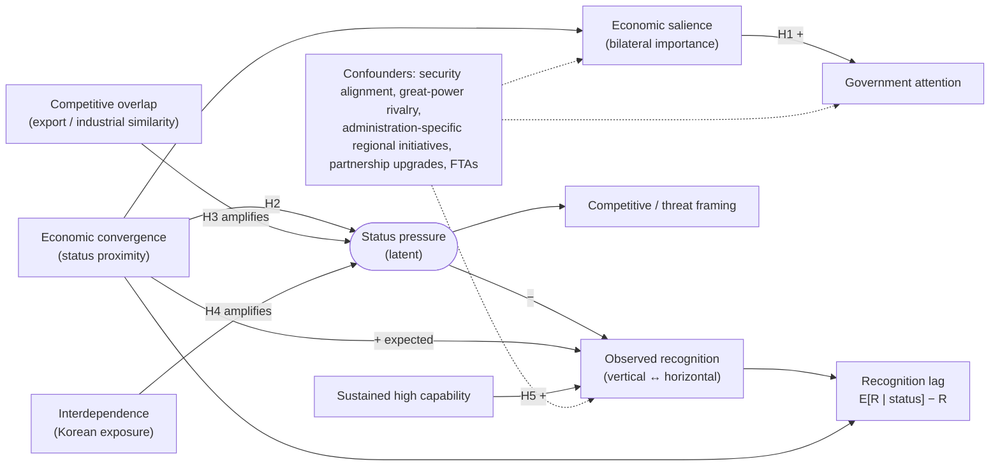

# Research design

*Working document. Substantive changes are logged in [decisions.md](decisions.md).*

## 1. Core puzzle

Economic convergence changes the objective distance between states faster than it changes how
governments talk about and position one another. As a lower-ranked partner approaches an
incumbent's material and industrial position, the incumbent has growing reasons to pay attention.
It may nonetheless keep describing the partner in hierarchical terms: as an aid recipient, a
production base or an emerging market, rather than as a peer. The puzzle is why, and under what
conditions, **attention** keeps pace with convergence while **recognition** lags behind it.

## 2. Theory

**Attention and recognition are distinct.** Attention is the volume of government focus on a
partner. Recognition is the *relational position* in which the partner is placed: vertical
(developmental, hierarchical) or horizontal (peer, co-equal). Economic importance is expected to
raise attention (H1) without automatically raising recognition.

**Status pressure.** Convergence becomes a status problem when it brings the rising state close to
the incumbent's own position. Pressure should be strongest:

- near the incumbent's position rather than far below it (proximity, H2);
- when the rising state's industrial and export structure overlaps with the incumbent's, so that
  convergence threatens the incumbent's niche (competitive overlap, H3);
- when the incumbent depends economically on the rising state, making the relationship both
  important and uncomfortable (interdependence, H4).

**Catch-up.** Once capability is high and sustained, withholding recognition becomes untenable.
Recognition then catches up, possibly while competitive concern stays high (H5). This makes the
proximity–recognition relationship potentially **nonlinear**: lag rises through the approach zone
and falls after sustained arrival.

**Recognition vs. concern.** Treating a partner as a competitor implies some acknowledgement of
parity. Competitive/threat framing is therefore measured as a separate dimension rather than as
low or high recognition. H5 needs the two to be separable.

## 3. Causal diagram

## 4. Hypotheses and observable implications

| | Hypothesis | Observable implication (partner-year panel) |
|---|---|---|
| H1 | Economic salience → attention | Lagged trade share (and alternatives) positively associated with attention measures, within partner over time. |
| H2 | Lag greatest near the incumbent | Recognition rises less than proportionally with proximity in an intermediate range, e.g. a concave or S-shaped relation; lag measures peak at intermediate-to-high proximity. |
| H3 | Overlap amplifies | The slope shortfall in H2 is larger at higher export similarity / RCA overlap (proximity × overlap). |
| H4 | Interdependence amplifies | The slope shortfall is larger when Korea's exposure (import/export dependence) is high (proximity × interdependence). |
| H5 | Catch-up | Above a pre-specified threshold of high and sustained capability, recognition converges on expectation, even where competitive framing stays high. |

## 5. Unit of analysis

- **Analytical unit:** directed dyad Korea → partner *j*, year *t*. The main panel has 12 partners.
  Periods are to be fixed after coverage checks.
- **Measurement units:** sentences (recognition framing), documents (attention), events (visits,
  summits, statements), products × years (overlap), country × year (status).
- **Higher frequency** (quarterly/monthly) is possible for attention and trade. It is a later
  option if the text series are dense enough.

## 6. Candidate operationalizations

### Objective status and status proximity
Partner values relative to Korea (ratio, log ratio, gap, absolute log gap; see
`srl.status.proximity`) for GDP per capita, productivity, manufacturing value added, export
sophistication (EXPY), high-tech export share and patents. A composite index uses the mean of
pooled z-scores; PCA is a later option. **Dimension matters:** Singapore exceeds Korea in GDP per
capita, and China exceeds Korea in aggregate size, so "lower-ranked" is dimension-specific.

### Competitive overlap
Finger–Kreinin export similarity, Balassa RCA and RCA overlap (Jaccard or rank correlation),
sectoral composition similarity, and overlap in high-value products. The last two require a
documented concordance and product list.

### Economic interdependence
Bilateral trade share, Korean export and import dependence, trade growth, rolling exposure,
concentration (HHI), FDI exposure and GVC exposure.

### Government attention
Counts of mentions, sentences and documents, shares of attention across all foreign entities, and
event counts. Group-level mentions (ASEAN) are analysed separately by default.

### Political recognition
Sentence-level frames: vertical, horizontal and competitive/threat. Indices are H/(H+V), (H−V)/(H+V)
and the empirical logit ln((H+0.5)/(V+0.5)). Measurement backends are a dictionary baseline,
embeddings, a supervised classifier and optional LLM-assisted coding. **All backends are validated
against the same human-coded sample** ([coding_protocol.md](coding_protocol.md)). Formal
partnership designations (ordinal tiers) are a candidate non-textual benchmark.

### Recognition lag: three approaches

| Approach | Definition | Advantages | Risks |
|---|---|---|---|
| **A. Standardized difference** | z(status) − z(recognition); pooled, within-year or within-partner standardization | Transparent; no model; easy to compare across partners | Assumes the two scales are commensurable once standardized; sensitive to the reference distribution; choice of status dimension drives results |
| **B. Residual recognition** | Fit E[recognition \| status (+ year effects)] by OLS; lag = fitted − observed | Expectation is estimated rather than assumed; functional form can be flexible | Residual is orthogonal to the fitted form by construction, so **testing H2 on B's residual against the same status terms is circular**; sensitive to specification; partner FE would absorb persistent under-recognition |
| **C. Dynamic adjustment** | Speed at which recognition responds to status changes (partial adjustment / ECM, local projections) | Closest to the idea of a *lag*; uses timing | Needs long, dense series per partner; weak power with 12 partners; persistence in text series may reflect bureaucratic routine |

**Design choice (proposed):** hypothesis tests use *observed recognition* as the outcome, with
flexible status-proximity terms and interactions. Lag measures (A–C) are used descriptively and
for robustness. Regressing a status-based lag measure on status induces mechanical correlation.

## 7. Identification problems

1. **Few units.** 12 partners means conventional cluster-robust inference is unreliable. Plan
   small-cluster inference (wild cluster bootstrap, randomization inference) and partner-by-partner
   descriptive evidence.
2. **Reverse causality and simultaneity.** Recognition and diplomatic upgrades can raise trade and
   investment (e.g., via FTAs), and attention can follow as well as lead economic ties. Use lagged
   economic measures and event timing. Treat causal claims cautiously.
3. **Mechanical correlation.** Lag measures built from status cannot serve as outcomes in models
   with status on the right-hand side (see §6).
4. **Common shocks.** China's rise, US–China rivalry, global crises and pandemic-era disruption
   affect all partners. Year fixed effects absorb common levels but not heterogeneous exposure.
5. **Corpus composition.** Changes in which institutions publish, which documents are archived, and
   which are translated into English can shift measured attention and recognition. Control for
   source and document type, and analyse Korean and English separately.
6. **Administration effects.** Regional initiatives tied to particular administrations can move
   attention and framing independently of economics. Administration indicators and within-period
   comparisons are needed.
7. **Formulaic diplomatic language.** Partnership vocabulary partly reflects formal designations
   and protocol rather than perception. Separate formal designations from discretionary framing.
8. **Partner-driven framing.** Vertical language (capacity building, development cooperation) may
   reflect what the partner requests or official development cooperation programmes, not Korean
   status perceptions. ODA-programme text needs special handling.
9. **Measurement validity across languages.** Dictionary terms and classifiers may perform
   differently in Korean and English. Validate per language.
10. **Multidimensional status.** Proximity on per-capita income, industrial capability and
    aggregate size can diverge (Singapore, China). Results must be shown per dimension.

## 8. Competing explanations

- **Security alignment and geopolitics:** recognition tracks security relations (e.g., toward
  China) rather than economic status.
- **Great-power structure:** framing of partners follows the US–China context, not bilateral
  convergence.
- **Domestic politics and administration agendas:** regional policy initiatives drive attention
  and framing.
- **Bureaucratic inertia:** templates and institutional routines produce slow-changing language
  regardless of status pressure. This would also generate "lag", so it must be distinguished,
  e.g. lag should vary with overlap and exposure (H3–H4), which inertia alone does not predict.
- **Development-cooperation portfolio:** vertical framing follows ODA flows and programme
  categories.
- **Societal ties:** migration, diaspora and tourism shape official framing.
- **Regime type and ideology:** governance similarity affects peer framing.
- **Partner self-positioning:** the partner's own diplomatic strategy (e.g., seeking developmental
  partnerships) shapes the language of joint statements.
